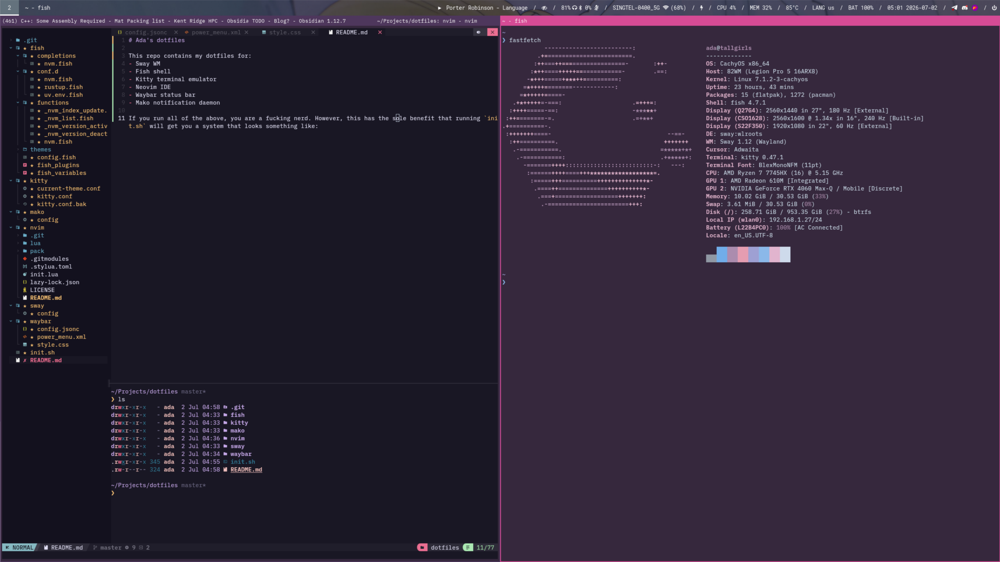

# Ada's dotfiles

This repo contains my dotfiles for:
- Sway WM
- Fish shell
- Kitty terminal emulator
- Neovim IDE
- Waybar status bar
- Mako notification daemon

If you run all of the above, you are a fucking nerd. However, this has the sole benefit that running `init.sh` will get you a system that looks something like:

